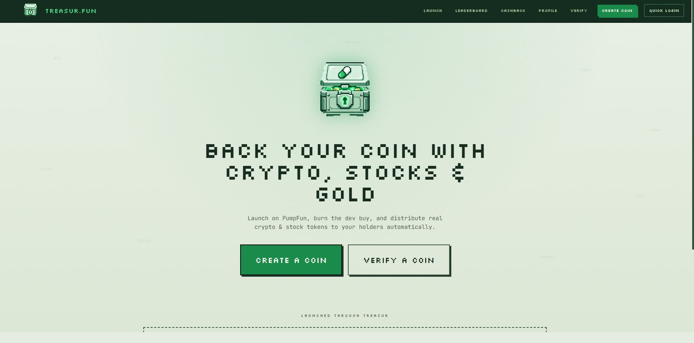

<div align="center">


# US

**Asset-backed coin infrastructure on Solana**

Launch a memecoin, back it with a real basket of crypto, stocks, gold and pre-IPO
equity, and let creator fees buy that basket and distribute it to holders —
automatically, on-chain, with no team in the middle.

[**unstablesafe.fun**](https://unstablesafe.fun) · [Whitepaper](https://unstablesafe.fun/whitepaper) · [Leaderboard](https://unstablesafe.fun/leaderboard) · [X](https://x.com/unstablesafe) · [GitHub](https://github.com/unstable-safe/UnstableSafe)

[](https://github.com/unstablesafe/UnstableSafe/actions/workflows/ci.yml)


<br />



</div>

---

## Overview

Unstable Safe gives memecoins a real floor. A creator launches a token on a standard
pump.fun bonding curve, then picks a basket of real, liquid assets to back it with.
From that point on, the trading fees the coin earns are used to **buy those assets
and send them directly to holders** — and a share of every coin's fees buys back and
burns the platform token, **$US**.

Unstable Safe never custodies holder funds and never touches the assets after they're
distributed. Every flow runs through public Solana programs and is verifiable on-chain.

## How it works

```
1. LAUNCH      Coin is created on the bonding curve; the dev buy is burned
               immediately → fair launch, zero team allocation, no presale.

2. BASKET      Creator picks which real assets back the coin (any mix of
               crypto, stocks, gold, pre-IPO) and the weight of each.

3. EARN        As the coin trades it earns creator fees. Unstable Safe claims them.

4. SPLIT       80%  → buys the basket (via Jupiter) and distributes it to
                      holders, pro-rata by holdings.
               20%  → treasury wallet, used to buy back & burn $US.

5. REPEAT      Runs in cycles, so backing accrues to holders continuously
               for as long as the coin is traded.
```

## Features

- **Asset-backed launches** — back any coin with crypto, tokenized stocks (xStocks),
  pre-IPO equity (PreStocks) and tokenized gold/silver. Every asset must have a live
  Jupiter route; illiquid tokens are never offered.
- **Fair launch by construction** — the dev buy is burned, so no one retains supply.
- **Automatic, pro-rata distribution** — holders receive the basket in proportion to
  their holdings, with a $10 eligibility floor and the bonding curve / creator wallet
  excluded.
- **$US buyback & burn** — 20% of every coin's fees funds the burn; each burn is
  executed on-chain with a published Solscan proof.
- **Treasury leaderboard** — projects ranked by how much they've sent to the treasury.
- **On-chain verification** — confirm any mint was launched through Unstable Safe, that its
  dev buy was burned, and what it distributes.
- **Two distribution modes** — `auto` (spray the basket to all holders each cycle) and
  `cashback` (hold-to-accrue, redeem into a pre-IPO asset), selectable per deployment.

## The 80 / 20 split

| Share | Destination | Purpose |
|------:|-------------|---------|
| **80%** | Holders | Buys the coin's asset basket and distributes it pro-rata |
| **20%** | Treasury wallet | Buys back & burns **$US** (manual, with Solscan proof) |

A small SOL buffer is always kept back each cycle to cover network fees.

## Tech stack

```
Frontend   React 19 · Vite 6 · Tailwind CSS         → Vercel
Backend    FastAPI · Python 3.11                     → Railway (volume at /data)

Solana     solders / solana-py     keypairs, transfers, SPL burns
pump.fun   pumpdev.io + PumpPortal create token + claim creator fees
Jupiter    swap API                SOL → asset basket swaps
Helius     RPC + DAS               holder enumeration
Pinata     IPFS                    token metadata + image pinning
```

## Project structure

```
unstablesafe/
├── backend/                  FastAPI service
│   ├── main.py               API routes
│   ├── orchestrator.py       launch lifecycle: create → burn → distribute (cycles)
│   ├── assets.py             asset registry (crypto / stocks / pre-IPO / commodities)
│   ├── config.py             settings & env
│   ├── models.py             launch / holder data models
│   ├── auth.py               register / login (PBKDF2)
│   ├── storage.py            encrypted launch + wallet persistence (/data)
│   └── services/
│       ├── pumpfun.py        token creation + fee claiming
│       ├── jupiter.py        quotes + swaps + USD pricing
│       ├── helius.py         holder lookups
│       ├── solana_client.py  signing, transfers, burns
│       ├── distribution.py   pro-rata basket distribution
│       └── cashback.py       hold-to-accrue cashback mode
│
└── frontend/                 React + Vite + Tailwind
    └── src/
        ├── pages/            Landing · Launch · Leaderboard · Whitepaper · Verify · Profile · Cashback
        ├── components/       Nav · ui · LoginModal
        └── api.js            API client
```

## Getting started

### Backend

```bash
cd backend
python -m venv .venv && source .venv/bin/activate
pip install -r requirements.txt

cp .env.example .env          # fill in the values below
# generate a Fernet key for ENCRYPTION_KEY:
python -c "from cryptography.fernet import Fernet; print(Fernet.generate_key().decode())"

uvicorn main:app --reload --port 8000
```

### Frontend

```bash
cd frontend
npm install
npm run dev                   # dev server
# point the API base in src/api.js (or the proxy) at your backend URL
```

## Configuration

All backend config is via environment variables. **Never commit real values** — keys
below are names only.

| Variable | Description |
|----------|-------------|
| `ENCRYPTION_KEY` | Fernet key encrypting launch wallet secrets at rest. **Never change once set.** |
| `SECRET_KEY` | Session/token signing secret. |
| `ADMIN_PASSWORD` | Password for the admin endpoints. |
| `RPC_ENDPOINT` | Solana RPC URL (Helius). |
| `HELIUS_API_KEY` | Helius key for holder enumeration. |
| `PUMPDEV_API_URL` | pump.fun create + claim API (default `https://pumpdev.io`). |
| `PUMPPORTAL_TRADE_URL` | PumpPortal local-trade endpoint. |
| `PINATA_JWT` / `PINATA_GATEWAY` | IPFS metadata pinning + dedicated gateway for images. |
| `JUPITER_QUOTE_URL` / `JUPITER_SWAP_URL` | Jupiter swap endpoints. |
| `TREASURY_WALLET` | Wallet that receives the 20% fee share. |
| `BURN_FEE_BPS` | Treasury share in basis points (`2000` = 20%). |
| `MIN_FUNDING_SOL` | SOL required to deploy a coin (`0.1`). |
| `DEV_BUY_SOL` / `BURN_DEV_BUY` | Dev-buy size and whether it's burned (fair launch). |
| `DISTRIBUTION_MODE` | `auto` or `cashback`. |
| `DISTRIBUTION_CYCLES` / `CYCLE_INTERVAL_SECONDS` | Number of cycles and spacing. |
| `MIN_HOLD_USD` | Eligibility floor for distributions (USD). |
| `SWAP_SLIPPAGE_BPS` / `TOKEN_DECIMALS` | Swap slippage and token decimals. |
| `DATA_DIR` | Persistent data directory (`/data`). |
| `SITE_NAME` | Display name used in generated metadata. |

## Deployment

### Backend → Railway

- Service **Root Directory** = `backend`. Attach a **persistent volume mounted at `/data`**
  (holds launch records and encrypted wallet keys — without it, every redeploy wipes them).
- Set the environment variables above.
- Deploy by pushing to the repo; Railway rebuilds automatically:

```bash
git add . && git commit -m "deploy" && git push
```

### Frontend → Vercel

```bash
cd frontend
vercel --prod
```

## API reference

**Public**

| Method | Endpoint | Description |
|--------|----------|-------------|
| `GET` | `/api/health` | Health check |
| `GET` | `/api/assets` | Available backing assets, grouped |
| `GET` | `/api/feed` | Coins launched through Unstable Safe |
| `GET` | `/api/leaderboard` | Projects ranked by $ sent to treasury |
| `GET` | `/api/verify/{mint}` | Verify a coin was launched via Unstable Safe |

**Auth**

| Method | Endpoint | Description |
|--------|----------|-------------|
| `POST` | `/api/auth/register` | Register (name + wallet + password) |
| `POST` | `/api/auth/login` | Log in |
| `GET` | `/api/me` | Current user |

**Launches**

| Method | Endpoint | Description |
|--------|----------|-------------|
| `POST` | `/api/launches` | Create a launch (returns a funding wallet) |
| `POST` | `/api/launches/{id}/start` | Start the launch once funded |
| `GET` | `/api/launches/{id}` | Launch status + log |
| `GET` | `/api/launches/{id}/balance` | Launch wallet balance |
| `GET` | `/api/launches/{id}/cashback` | Cashback accrual (cashback mode) |
| `POST` | `/api/launches/{id}/claim` | Claim cashback into an asset |
| `POST` | `/api/launches/{id}/withdraw` | Withdraw SOL from a launch wallet |
| `POST` | `/api/withdraw-all` | Withdraw across launches |

## Roadmap

- [x] Asset-backed launches — crypto, tokenized stocks, pre-IPO, gold
- [x] Fair launch — dev buy burned, zero team allocation
- [x] Pro-rata auto distribution + cashback mode
- [x] 20% treasury → manual $US buyback & burn with on-chain proof
- [x] Treasury leaderboard
- [x] On-chain verification
- [x] Whitepaper
- [ ] Expanded asset registry — more verified, liquid tokens
- [ ] USDC-paired launches (pending pump.fun V2 + provider support)
- [ ] Automated buyback & burn once $US has a live Jupiter route
- [ ] Daily top-burner competition — prize pool for the top projects
- [ ] Exclude migrated AMM pools from distribution
- [ ] Holder analytics dashboard

## Security

- Launch wallet private keys are **encrypted at rest** (Fernet) under `ENCRYPTION_KEY`
  and stored in `DATA_DIR`. Treat the data volume and that key as highly sensitive.
- User passwords are PBKDF2-hashed; never stored in plaintext.
- The treasury share goes to a wallet you control; the $US buyback & burn is
  performed manually from there, with each burn published on-chain.
- Always run behind the persistent volume so wallet keys survive redeploys.

## Disclaimer

Unstable Safe is experimental software for a volatile asset class. Memecoins can and
frequently do go to zero; asset backing reduces but does not remove that risk, and the
value of any backing depends on the market price and liquidity of the underlying
assets. Tokenized stocks and pre-IPO tokens track a price and do not confer shareholder
rights, dividends or legal ownership. Nothing here is financial, investment or legal
advice.
